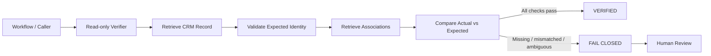

# CRM Association Verifier

> A read-only verification layer for CRM workflows that checks record identity and associations before downstream automation is trusted.

## Overview

CRM automation is only as reliable as the data and relationships underneath it.

A workflow can execute exactly as designed and still produce the wrong outcome if the underlying record is incomplete, linked to the wrong entity, or missing an expected relationship. This project was built to add an independent verification step before downstream workflow state is treated as trustworthy.

The verifier is deliberately **read-only** and **fail-closed**. It does not repair uncertain data or force a workflow forward. When evidence is incomplete, inconsistent, or ambiguous, the safe outcome is to stop and surface the case for review.

## The business problem

In a multi-record CRM process, downstream actions may depend on relationships between records such as:

- a primary business record
- the correct contact
- the correct commercial opportunity

The normal workflow is straightforward when every identifier and association is correct. The difficult cases are the exceptions:

- a record exists, but an expected identifier is missing
- a contact or opportunity does not match the expected ID
- a required relationship is absent
- the CRM API returns an error or malformed response
- the available evidence is not strong enough to prove the relationship safely

If those cases are treated as successful, automation can scale bad decisions just as efficiently as good ones.

## Design goal

**Automate the predictable path. Stop on ambiguity. Verify before trust.**

The verifier acts as an independent control layer:



No CRM write is required to reach the verification result.

## What the verifier checks

At a high level, the service:

1. receives the expected record identifiers
2. retrieves the relevant CRM record
3. validates identity fields against the expected values
4. retrieves the record's relationships
5. confirms that the expected contact relationship exists
6. confirms that the expected opportunity relationship exists
7. returns a verification result only when the required evidence is present and consistent

## Fail-closed behaviour

A successful verification should require positive evidence.

| Condition | Expected behaviour |
| --- | --- |
| Record found and expected relationships match | **VERIFIED** |
| Required identity value missing | **FAIL CLOSED** |
| Contact identity mismatch | **FAIL CLOSED** |
| Opportunity identity mismatch | **FAIL CLOSED** |
| Expected relationship missing | **FAIL CLOSED** |
| CRM/API error | **FAIL CLOSED** |
| Malformed or incomplete response | **FAIL CLOSED** |
| Evidence is ambiguous | **REVIEW / DO NOT ADVANCE** |

The important principle is that an error is not treated as a pass.

## Why read-only matters

The verifier is intentionally separated from the workflow that performs operational changes.

That separation reduces the risk that a verification component can accidentally:

- overwrite CRM data
- create or alter relationships
- advance workflow state
- trigger downstream communications
- hide an upstream data-quality problem by "fixing" it silently

Verification and mutation are different responsibilities.

## Human-in-the-loop control

Not every exception should be automated away.

Some cases require judgement because the available evidence is genuinely ambiguous. In those situations, the system should make the uncertainty visible rather than manufacture confidence.

The operating principle is:

> **High-confidence routine case → automate**  
> **Low-confidence or conflicting evidence → stop and review**

This is the same control philosophy I am applying more broadly to AI-enabled revenue and operations workflows.

## Validation status

| Area | Status |
| --- | --- |
| Core verification logic | Built |
| Read-only architecture | Built |
| Fail-closed conditions | Built and tested |
| Unit tests | **41 passed / 0 failed** |
| Packaging / Wrangler dry run | Passed |
| Live end-to-end production certification | **Still outstanding** |

This distinction is intentional. The project is presented as tested verification logic, **not** as fully production-certified until live end-to-end validation is complete.

## What this project demonstrates

### Technical-commercial capability

- API-based verification
- CRM relationship validation
- structured-data handling
- identity and association checks
- exception handling
- fail-safe workflow design
- human-review gates
- test-driven validation
- separation of read and write responsibilities

### Systems thinking

The project started with an operating problem rather than a coding exercise:

**How do you scale automation without allowing uncertain data to create confident downstream actions?**

The answer was not simply "add more automation." It was to introduce an independent control layer with explicit decision boundaries.

## Broader architecture principle

The project sits inside a wider commercial-systems approach:

```text
Business problem
      ↓
Process definition
      ↓
Structured data
      ↓
Workflow automation
      ↓
Independent verification
      ↓
Human review where needed
      ↓
Measured iteration
```

That pattern is increasingly relevant to agentic and AI-enabled workflows, where the cost of an incorrect automated action can be higher than the cost of pausing for review.

## Current project status

This repository is currently **private** while the implementation is being prepared for portfolio use.

Before any public release:

- live credentials and secrets will remain excluded
- customer and contact data will remain excluded
- internal identifiers will be removed or replaced with safe examples
- configuration will be documented using placeholders
- claims will remain limited to what has actually been tested

## Author

**Joel Gabriel Pascal**  
Enterprise GTM & Strategic Sales | AI | SaaS | APIs | Data | Revenue Systems

This project is part of a broader body of work focused on the intersection of enterprise commercial execution, CRM architecture, automation, verification controls, and practical AI-enabled operating systems.
