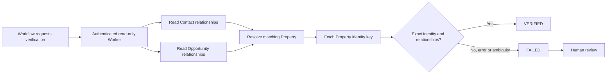

# Architecture and verification boundaries

The Worker only sends GET requests to the CRM. A verified response is a decision signal, **not** a CRM mutation or proof of production deployment. Network failures, incomplete pagination, mismatched records, malformed responses and conflicting relationships must fail closed.

## Evidence boundary
The repository documents 41 passing unit tests. Live end-to-end certification of this sanitized portfolio version is not claimed.
